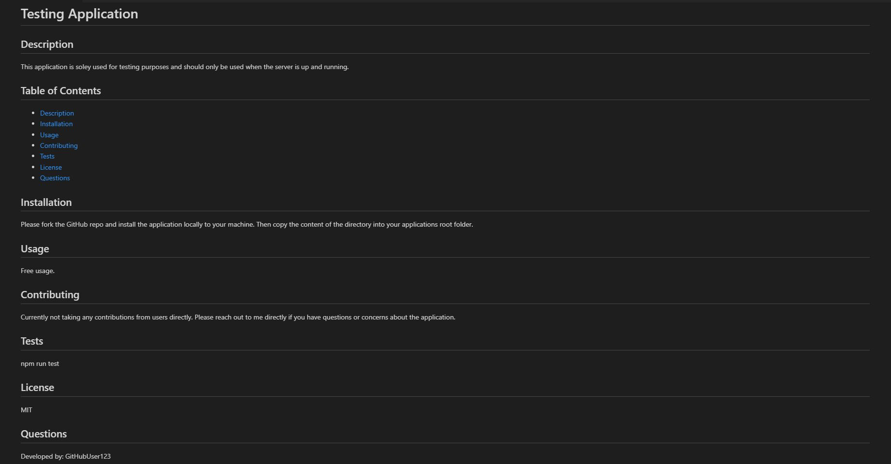

# Professional-README-Generator
Backend application used to create Professional README


## Description
This is a command-line application used to generate a readme based user responses. The application loops through an array of questions using the inquirer package to save the reponses to be used by the File System package to write the given responses to a README file with a profressional template. A sample README can also be found in the assets folder for reference.


## Screenshot



## Link
[Click here](https://github.com/johnfoxwell/Professional-README-Generator)


## Developed by:
```
John Foxwell
```
